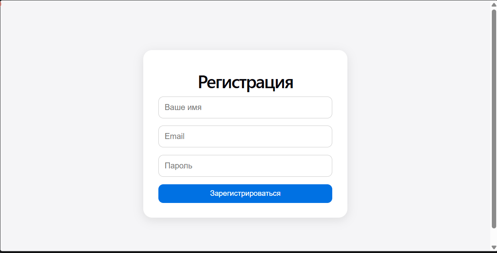
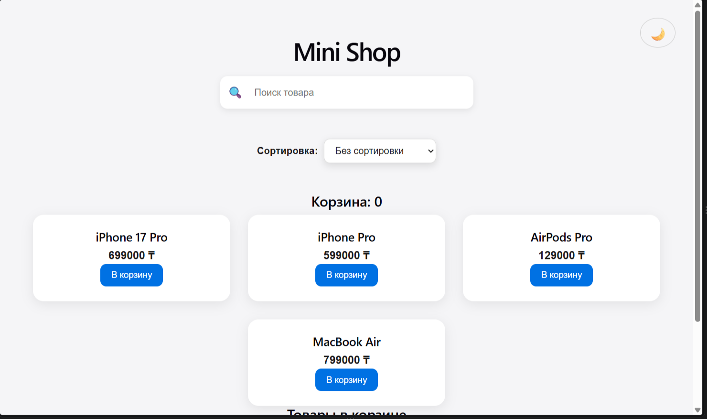
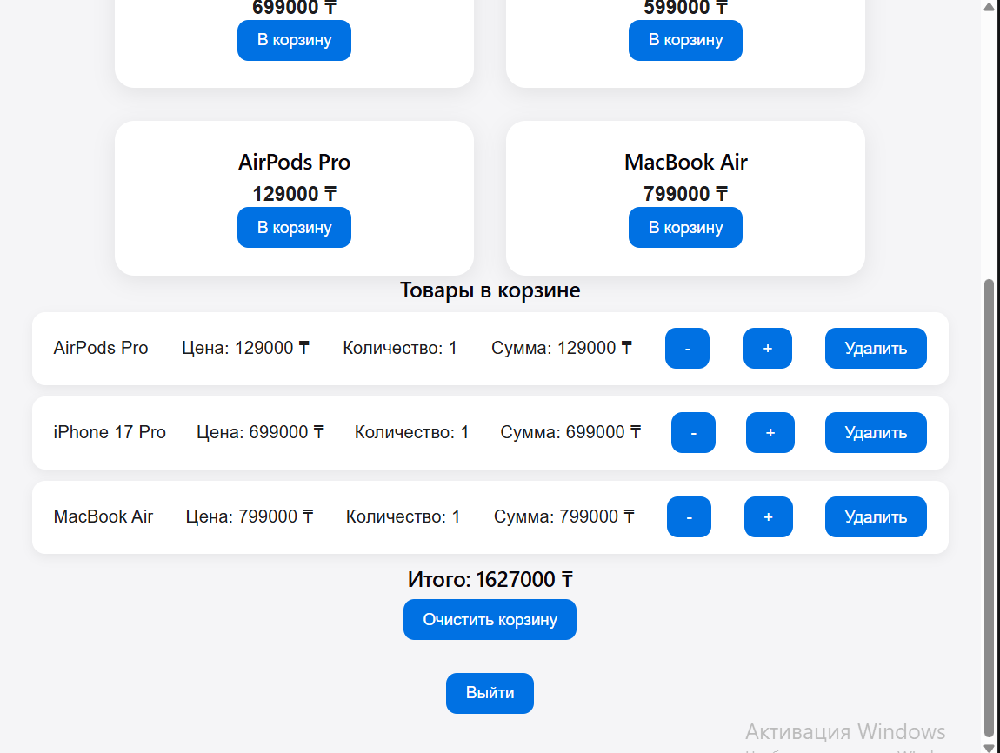

# React Mini Shop

Учебный интернет-магазин, созданный на React + Vite.

Проект сделан для практики работы с React, состоянием, массивами, localStorage и основными возможностями интернет-магазина.

## 🌐 Демо

https://react-mini-shop-eosin.vercel.app

## 🚀 Возможности

- Регистрация пользователя
- Выход из аккаунта
- Поиск товаров
- Сортировка товаров по цене
- Добавление товаров в корзину
- Увеличение количества товара
- Уменьшение количества товара
- Удаление товара из корзины
- Очистка всей корзины
- Подсчёт общей стоимости
- Сохранение корзины через localStorage
- Сохранение состояния регистрации
- Светлая и тёмная тема
- Адаптивная версия для мобильных устройств

## 🛠 Технологии

- React
- JavaScript
- HTML
- CSS
- Vite
- localStorage
- Git
- GitHub
- Vercel

## 📸 Скриншоты

### Регистрация



### Магазин



### Корзина



## 💻 Запуск проекта

Склонируйте репозиторий:

```bash
git clone https://github.com/sanjisadsad-cloud/react-mini-shop.git
```

Перейдите в папку проекта:

```bash
cd react-mini-shop
```

Установите зависимости:

```bash
npm install
```

Запустите проект:

```bash
npm run dev
```

После запуска проект будет доступен локально в браузере.

## 📚 Что я изучил в этом проекте

Во время разработки проекта я использовал:

- `useState`
- `useEffect`
- `map()`
- `filter()`
- `find()`
- `forEach()`
- `sort()`
- условный рендеринг
- обработчики событий
- controlled inputs
- localStorage
- работу с массивами объектов
- работу с Git и GitHub
- деплой проекта на Vercel

## 👨‍💻 Автор

Sanzhar Bekseitov